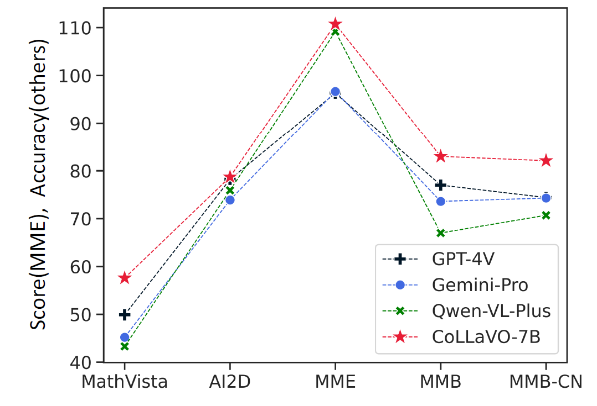
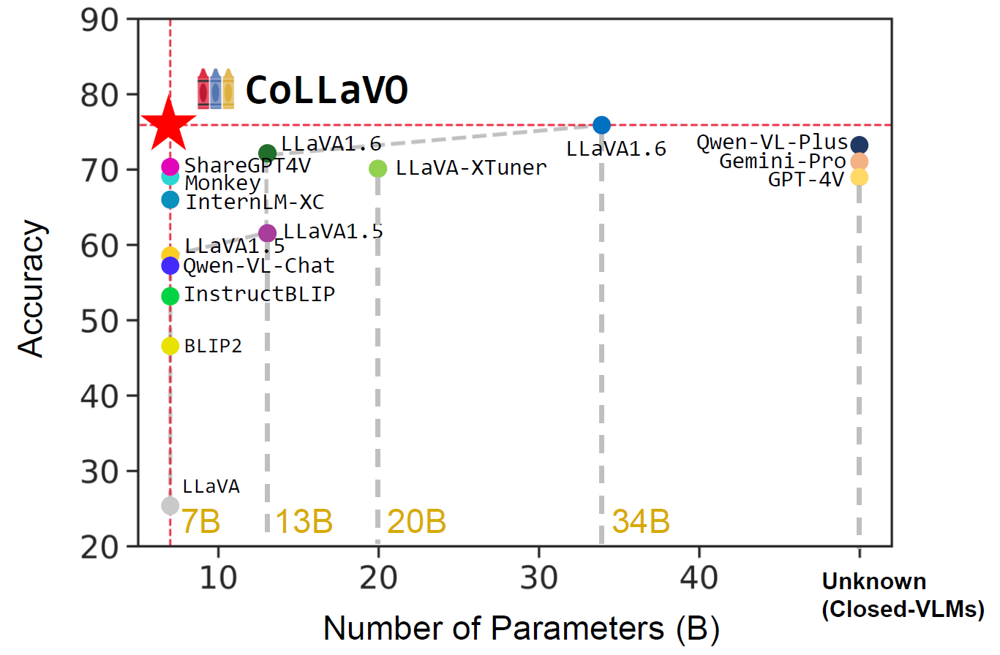
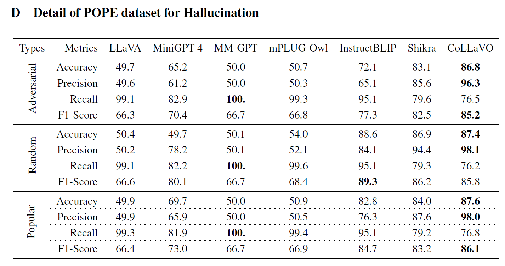

#  ***CoLLaVO: Crayon Large Language and Vision mOdel*** [[arxiv]](https://arxiv.org/abs/2402.11248)

### 🎨 In-Progress
- [ ] Code will be made public.
- [ ] Downloading CoLLaVO-7B will be available.

---

Official PyTorch implementation code for realizing the technical part of *Crayon Large Language and Vision mOdel (CoLLaVO)* to improve performance of numerous zero-shot vision language tasks.
This code is developed on two baseline codes of [XDecoder: Generalized Decoding for Pixel, Image, and Language](https://github.com/microsoft/X-Decoder) accepted in [CVPR 2023](https://openaccess.thecvf.com/content/CVPR2023/papers/Zou_Generalized_Decoding_for_Pixel_Image_and_Language_CVPR_2023_paper.pdf)
and [InternLM](https://github.com/InternLM/InternLM) for [Technical Paper](https://github.com/InternLM/InternLM-techreport/blob/main/InternLM.pdf). Later, I will make the code simplified further from the scratch (planned in mid March). Please understand the dirty code in the current version combining two technical code implementation, which brings in too many redundant lines! Stay tuned!


- [x] Implemented with **Accelerate (DeepSpeed, FSDP, DDP), PEFT, Transformers, BitsandBytes** in Huggingface.

- [x] Trained on 4bit QLORA.

- [x] Supporting multi-node training with multiple server machines thanks to Accelerate.

## 🏝️ Summary

The remarkable success of Large Language Models (LLMs) and instruction tuning drives the evolution of Vision Language Models (VLMs) towards a versatile general-purpose model. Yet, it remains unexplored whether current VLMs genuinely possess quality object-level image understanding capabilities determined from 'what objects are in the image?' or 'which object corresponds to a specified bounding box?'. Our findings reveal that the image understanding capabilities of current VLMs are strongly correlated with their zero-shot performance on vision language (VL) tasks. This suggests that prioritizing basic image understanding is crucial for VLMs to excel at VL tasks. To enhance object-level image understanding, we propose Crayon Large Language and Vision mOdel ( **CoLLaVO**), which incorporates instruction tuning with *Crayon Prompt* as a new visual prompt tuning scheme based on panoptic color maps. Furthermore, we present a learning strategy of *Dual QLoRA* to preserve object-level image understanding without forgetting it during visual instruction tuning, thereby achieving a significant leap in numerous VL benchmarks in a zero-shot setting.

## 🚀 Highlights


<figcaption>
Figure. Zero-shot performance of CoLLaVO-7B on challenging VL datasets compared with closed-source VLMs: GPT-4V, Gemini-Pro, Qwen-VL-Plus. Note: The scores of MME are rescaled by 1/20 to match the scales with the accuracies of others.
</figcaption>


<figcaption>
Figure. Demonstrating the efficiency and effectiveness of CoLLaVO compared with those of other VLMs. Note that accuracy is measured on SEED-IMG.
</figcaption>



<figcaption>
Table. Measuring four metrics: Accuracy, Precision, Recall, F1-score on three types of question answering to evaluate hallucination of vision language models: Adversarial, Random, and Popular in POPE.
</figcaption>


## 📖 Citation

```
@misc{lee2024collavo,
      title={CoLLaVO: Crayon Large Language and Vision mOdel}, 
      author={Byung-Kwan Lee and Beomchan Park and Chae Won Kim and Yong Man Ro},
      year={2024},
      eprint={2402.11248},
      archivePrefix={arXiv},
      primaryClass={cs.CV}
}
```


##  Download CoLLaVO-7B (Under Preparation)

|                 |    GQA   |  SQA-IMG |  TextVQA |   POPE   |    MME-P   |   MME-C   | MM-Bench |  MMB-CN  |  MM-Vet  |  Q-Bench |
|-----------------|:--------:|:--------:|:--------:|:--------:|:----------:|:---------:|:--------:|:--------:|:--------:|:--------:|
| [BLIP2-13B](https://huggingface.co/docs/transformers/model_doc/blip-2)       |   42.4   |   61.0   |   42.5   |   85.3   |   1293.8   |   290.0   |     -    |     -    |   22.4   |     -    |
| [InstructBLIP-7B](https://huggingface.co/docs/transformers/model_doc/instructblip) |   49.5   |   49.2   |   60.5   |   50.1   |      -     |     -     |   36.0   |   23.7   |   25.6   |   56.7   |
| [Qwen-VL-Chat-7B](https://github.com/QwenLM/Qwen-VL) |   57.5   |   68.2   |   61.5   |     -    |   1487.5   |   360.7   |   60.6   |   56.7   |     -    |     -    |
| [LLaVA1.5-7B](https://huggingface.co/docs/transformers/model_doc/llava)     | **62.0** |   66.8   |   58.2   |   85.9   |   1510.7   |   293.8   |   64.3   |   58.3   |   30.5   |   58.7   |
| [CoLLaVO-7B](https://sites.google.com/view/deepvisionresearcher)      |   61.4   | **80.7** | **64.2** | **87.2** | **1689.7** | **525.0** | **83.0** | **82.1** | **40.3** | **67.6** |


## 📂 Directory Layout
    .
    ├── asset                           # Required package lists (Important)
    ├── trainer                         # Training CoLLaVO and initializing optimizer (Not Support Now)
    ├── utils                           # Michallengeous util files (Not important)
    ├── collavo                         # CoLLaVO architecture & loading collavo (Important)
    ├── pipeline                        # Evaluating zero-shot vision language tasks (Important)
    │
    ├── datasets                        # Important
    │   ├── dataset_mappers             # data parsing including augmentation for loader
    │   ├── evaluation                  # measuring evaluation for each dataset 
    │   └── registration                # register dataset
    │
    ├── configs                         
    │   ├── accel                       # Accelerate Config files (Support Deepspeed, DDP, Multinode)
    │   ├── collavo_step1.yaml          # STEP1 config file (Not Support Now)
    │   ├── collavo_step2.yaml          # STEP2 config file (Support Inference Only, Important)
    │   └── vl_test.yaml                # Evaluating other vision language models (Not Support Now)
    │
    ├── modeling                        # Not Important
    │   ├── architectures               # training the prototype of collavo (Not Support Now)
    │   ├── utils                       # utils for modeling (Not important)
    │   └── BaseModel                   # loading and saving model (Important)
    │
    ├── lbk_entry.py                    # main code of control tower (Important)
    ├── run                             # bash file for running the evaluation (Important)
    │
    ├── install                         # install required packages (Important)
    └── README.md

---
## 💡 How to Run?


> In bash file of `install`, you should first run the following lines.


```shell script
conda create -n collavo python=3.9
conda activate collavo
conda clean -a && pip cache purge
conda install pytorch==2.0.1 torchvision==0.15.2 torchaudio==2.0.2 pytorch-cuda=11.8 -c pytorch -c nvidia
pip install -r assets/requirements/requirements.txt
pip install -r assets/requirements/requirements_custom.txt
pip install flash-attn --no-build-isolation
```

> In addition, you should set the following environment variables to set the dataset path.

```shell script
export DETECTRON2_DATASETS=/path/to/dataset
export DATASET=/path/to/dataset
export DATASET2=/path/to/dataset
export VLDATASET=/path/to/dataset
```

> Download CoLLaVO Model and then,


```shell bash
GPU_DEVICE="0,1,2,3"
length=${#GPU_DEVICE}
n_gpu=$(((length+1)/2))
main_port=10000
test_batch=5

# CoLLaVOPipeline
CUDA_VISIBLE_DEVICES=$GPU_DEVICE \
            accelerate launch --config_file configs/accel/ddp_accel.yaml \
            --num_processes=$n_gpu \
            --main_process_port=$main_port \
            lbk_entry.py eval \
            --conf_files configs/collavo_step2.yaml \
            --overrides \
            WANDB False \
            DATASETS.TEST pope_test\
            PIPELINE CoLLaVOPOPEPipeline \
            GQA.TEST.BATCH_SIZE_TOTAL $((n_gpu * test_batch)) \
            SCIENCEQA.TEST.BATCH_SIZE_TOTAL $((n_gpu * test_batch)) \
            TEXTVQA.TEST.BATCH_SIZE_TOTAL $((n_gpu * test_batch)) \
            POPE.TEST.BATCH_SIZE_TOTAL $((n_gpu * test_batch)) \
            MME.TEST.BATCH_SIZE_TOTAL $((n_gpu * test_batch)) \
            MMBENCH.TEST.BATCH_SIZE_TOTAL $((n_gpu * test_batch)) \
            MMVET.TEST.BATCH_SIZE_TOTAL $((n_gpu * test_batch)) \
            QBENCH.TEST.BATCH_SIZE_TOTAL $((n_gpu * test_batch)) \
            MATHVISTA.TEST.BATCH_SIZE_TOTAL $((n_gpu * test_batch)) \
            AI2D.TEST.BATCH_SIZE_TOTAL $((n_gpu * test_batch)) \
            SEED.TEST.BATCH_SIZE_TOTAL $((n_gpu * test_batch)) \
            HALLUSIONBENCH.TEST.BATCH_SIZE_TOTAL $((n_gpu * test_batch)) \
            WEIGHT True \
            RESUME_FROM /path/to/CoLLaVO \
```

Note that, you should change the two parts to evaluate the dataset you want. (**This is very important!!**)


> DATASETS.TEST

* GQA: `gqa_testdev_balanced`
* SQA-IMG: `scienceqa_test`
* TextVQA: `textvqa_val`
* POPE: `pope_test`
* MME: `mme`
* MM-Bench: `mmbench` or `mmbench_cn`
* MM-Vet: `mm-vet`
* Q-Bench: `qbench_dev`
* MATHVISTA: `mathvista_testmini`
* AI2D: `ai2d`
* SEED-IMG: `seed`
* HallusionBench: `hallusionbench`

> PIPELINE

* GQA: `CoLLaVOGQAPipeline`
* SQA-IMG: `CoLLaVOSQAPipeline`
* TextVQA: `CoLLaVOTextVQAPipeline`
* POPE: `CoLLaVOPOPEPipeline`
* MME: `CoLLaVOMMEPipeline`
* MM-Bench: `CoLLaVOMMBenchPipeline`
* MM-Vet: `CoLLaVOMMVetPipeline`
* Q-Bench: `CoLLaVOQBenchPipeline`
* MATHVISTA: `CoLLaVOMathVistaPipeline`
* AI2D: `CoLLaVOAI2DPipeline`
* SEED-IMG: `CoLLaVOSEEDPipeline`
* HallusionBench: `CoLLaVOHallusionPipeline`

> GPT-4 Aid Evalution for AI2D, MM-Vet, SEED-IMG

This code will be soon public!


## 🍅 Download Datasets
* [GQA](https://cs.stanford.edu/people/dorarad/gqa/about.html)
* [SQA-IMG](https://scienceqa.github.io/)
* [TextVQA](https://textvqa.org/)
* [POPE](https://github.com/RUCAIBox/POPE)
* [MME](https://github.com/BradyFU/Awesome-Multimodal-Large-Language-Models/tree/Evaluation)
* [MM-Bench](https://github.com/open-compass/MMBench?tab=readme-ov-file)
* [MM-Vet](https://github.com/yuweihao/MM-Vet)
* [Q-Bench](https://github.com/Q-Future/Q-Bench)
* [MathVista](https://github.com/lupantech/MathVista)
* [AI2D](https://allenai.org/data/diagrams)
* [SEED-IMG](https://github.com/AILab-CVC/SEED-Bench)
* [HallusionBench](https://github.com/tianyi-lab/HallusionBench)

## 📂 Dataset Directory (/path/to/dataset)
    .
    ├── GQA                             # GQA
    ├── ScienceQA                       # SQA-IMG
    ├── TextVQA                         # TextVQA
    ├── POPE                            # POPE
    ├── MME_Benchmark_release_version   # MME
    ├── MMBench                         # MM-Bench
    ├── mm-vet                          # MM-Vet
    ├── LLVisionQA-QBench               # Q-Bench
    ├── MathVista                       # MathVista
    ├── SEED-Bench                      # SEED-IMG
    ├── ai2d                            # AI2D
    └── HallusionBench                  # HallusionBench


